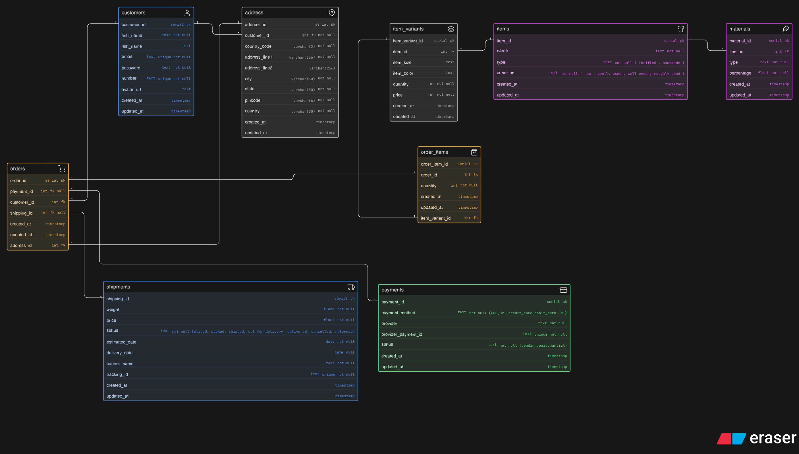

# Instagram Thrift Creator Store

A database design for an Instagram-based thrift store where creators sell thrifted fashion items and handmade products. This schema supports product variations, order management, payments, and shipping workflows.

## 🚀 Features

- Customer management with multiple addresses
- Thrifted & handmade product support
- Product variants (size, color, quantity, pricing)
- Order system with multiple items
- Payment tracking
- Shipping & delivery lifecycle tracking

## 📦 Core Entities

- **Customers**  
  Stores user information like name, email, phone, and avatar.

- **Address**  
  Supports multiple addresses per customer for flexible delivery.

- **Items**  
  Represents products (thrifted or handmade) with condition details.

- **Materials**  
  Defines material composition of items (e.g., cotton 80%).

- **Item Variants**  
  Handles size, color, quantity, and price combinations.

- **Orders**  
  Represents a purchase made by a customer.

- **Order Items**  
  Stores items inside an order with quantity.

- **Payments**  
  Tracks payment method, provider, and status.

- **Shipments**  
  Manages delivery process, tracking, and status updates.

## 🔗 Relationships

- Customer --> Address (1:M)
- Customer --> Orders (1:M)
- Item --> Variants (1:M)
- Item --> Materials (1:M)
- Order --> Order Items (1:M)
- Order_Item --> Variant (1:1)
- Order --> Address (1:1)
- Order --> Payment (1:1)
- Order --> Shipment (1:1)
